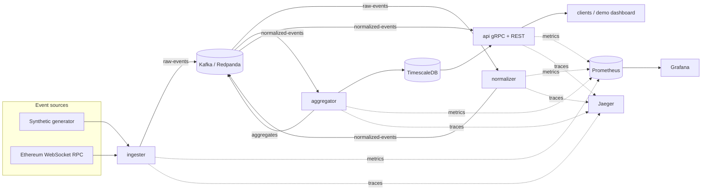

# StreamForge

A real-time blockchain event pipeline in Go. Chain events are ingested over a
streaming source, published to Kafka, normalized and enriched by a consumer
group, folded into windowed aggregates, and served over a gRPC API with a
REST/JSON gateway. The whole stack runs locally on Docker Compose and deploys to
Kubernetes via a Helm chart, with Prometheus/Grafana metrics and OpenTelemetry
tracing.

> Status: **M0 — scaffold & contracts.** Protobuf contracts, the shared config
> and telemetry packages, the synthetic event source, and the CI pipeline are in
> place. Kafka wiring, the live Ethereum source, the windowing engine, the gRPC
> server, and the Helm deploy land in M1–M6 (see [Roadmap](#roadmap)).

## Architecture



| Service      | Role |
|--------------|------|
| `ingester`   | Reads an event source, decodes to a canonical `ChainEvent`, produces to `raw-events` |
| `normalizer` | Consumer group on `raw-events`; validates + enriches; produces to `normalized-events` |
| `aggregator` | Windowed stream processing over `normalized-events`; writes closed windows to `aggregates` and TimescaleDB |
| `api`        | gRPC server (server-streaming live events, aggregate queries, stats) + grpc-gateway REST |

The event source is an interface with two implementations: a **synthetic
generator** (no network, drives CI, demos, and load tests) and a **live
Ethereum** `newHeads` subscription against a keyless public endpoint.

## Tech

Go 1.27 · gRPC · Protocol Buffers (`buf`) · Kafka API via Redpanda · TimescaleDB ·
Prometheus · Grafana · OpenTelemetry · Jaeger · Docker · Kubernetes · Helm ·
golangci-lint · GitHub Actions

## Prerequisites

- Go 1.27+
- Docker + Docker Compose
- `buf` (`brew install buf`)
- `golangci-lint` (`brew install golangci-lint`)

## Quickstart

```bash
make tools      # install pinned protoc-gen-go / protoc-gen-go-grpc
make proto      # lint protobuf + regenerate ./gen
make build      # build all four service binaries into ./bin
make test       # go test -race ./...
make lint       # golangci-lint

make up         # start Redpanda, TimescaleDB, Prometheus, Grafana, Jaeger
make run-ingester   # M0: streams synthetic events and logs throughput
make down
```

Local endpoints once `make up` is running:

| Service           | URL |
|-------------------|-----|
| Redpanda broker   | `localhost:19092` |
| Redpanda Console   | http://localhost:8085 |
| TimescaleDB       | `localhost:5432` (`streamforge` / `streamforge`) |
| Prometheus        | http://localhost:9091 |
| Grafana           | http://localhost:3000 (anonymous admin) |
| Jaeger UI         | http://localhost:16686 |

## Configuration

All services are configured through environment variables; see
[`.env.example`](.env.example) for the full list and defaults. `config.Load`
fails fast on malformed or out-of-range values.

## Layout

```
cmd/<service>/      service entrypoints
internal/config/    env-driven configuration + validation
internal/source/    event source interface + synthetic generator
internal/telemetry/ structured logging (metrics + tracing added later)
proto/              protobuf contracts (buf)
gen/                generated Go (committed; CI checks it is current)
deploy/compose/     local infra stack
deploy/prometheus/  scrape config
deploy/grafana/     datasource + dashboard provisioning
```

## Roadmap

| Milestone | Scope |
|-----------|-------|
| **M0** | Scaffold, protobuf contracts, config/telemetry, synthetic source, CI |
| M1 | Ingester → Kafka producer, Prometheus metrics, health endpoint, integration tests (testcontainers) |
| M2 | Live Ethereum WebSocket source: reconnect/backoff, dedup |
| M3 | Normalizer + aggregator: consumer groups, tumbling windows, TimescaleDB, checkpointing |
| M4 | gRPC API (server-streaming) + grpc-gateway REST + demo dashboard + API-key auth |
| M5 | Dockerfiles, Helm chart, `kind` cluster, Grafana dashboards, OpenTelemetry + Jaeger |
| M6 | k6 load test, tuning (partitions / batching / parallelism), end-to-end lag write-up |
