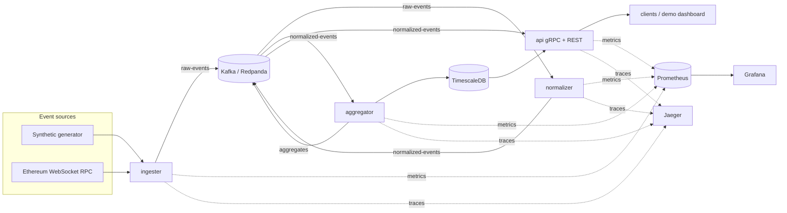

# StreamForge

A real-time blockchain event pipeline in Go. Chain events are ingested over a
streaming source, published to Kafka, normalized and enriched by a consumer
group, folded into windowed aggregates, and served over a gRPC API with a
REST/JSON gateway. The whole stack runs locally on Docker Compose and deploys to
Kubernetes via a Helm chart, with Prometheus/Grafana metrics and OpenTelemetry
tracing.

> Status: **M6 — load testing and tuning.** All four
> services ship as distroless images and deploy to a local `kind` cluster with
> one `helm install`, alongside single-replica Redpanda, TimescaleDB,
> Prometheus, Grafana and Jaeger. Traces follow an event end to end — the trace
> context rides in Kafka record headers, so one Jaeger trace spans ingester,
> normalizer and aggregator across three processes and two topics. A provisioned
> Grafana dashboard covers every pipeline stage. Measured throughput results
> and the tuning that produced them are in
> [docs/PERFORMANCE.md](docs/PERFORMANCE.md) — including a 6.8x normalizer
> throughput gain from one producer setting.

## Architecture


```mermaid
flowchart LR
  subgraph sources[Event sources]
    syn[Synthetic generator]
    eth[Ethereum WebSocket RPC]
  end
  syn & eth --> ing[ingester]
  ing -- raw-events --> k[(Kafka / Redpanda)]
  k -- raw-events --> norm[normalizer]
  norm -- normalized-events --> k
  k -- normalized-events --> agg[aggregator]
  agg -- aggregates --> k
  agg --> ts[(TimescaleDB)]
  k -- normalized-events --> api[api  gRPC + REST]
  ts --> api
  api --> client[clients / demo dashboard]
  ing & norm & agg & api -.metrics.-> prom[(Prometheus)]
  prom --> graf[Grafana]
  ing & norm & agg & api -.traces.-> jae[Jaeger]
```

| Service      | Role |
|--------------|------|
| `ingester`   | Reads an event source, decodes to a canonical `ChainEvent`, produces to `raw-events` |
| `normalizer` | Consumer group on `raw-events`; validates + enriches; produces to `normalized-events` |
| `aggregator` | Windowed stream processing over `normalized-events`; writes closed windows to `aggregates` and TimescaleDB |
| `api`        | gRPC server (server-streaming live events, aggregate queries, stats) + grpc-gateway REST |

The event source is an interface with two implementations: a **synthetic
generator** (no network, drives CI, demos, and load tests) and a **live
Ethereum** `newHeads` subscription against a keyless public endpoint.

## Tech

Go 1.27 · gRPC · Protocol Buffers (`buf`) · Kafka API via Redpanda · TimescaleDB ·
Prometheus · Grafana · OpenTelemetry · Jaeger · Docker · Kubernetes · Helm ·
golangci-lint · GitHub Actions

## Prerequisites

- Go 1.27+
- Docker + Docker Compose
- `buf` (`brew install buf`)
- `golangci-lint` (`brew install golangci-lint`)
- For the Kubernetes path: `kind` and `helm` (`brew install kind helm`).
  Give Docker's VM at least 6GB — the cluster runs Redpanda, TimescaleDB,
  Prometheus, Grafana, Jaeger and five application pods on one node.

## Quickstart

```bash
make tools       # install pinned protoc-gen-go / protoc-gen-go-grpc
make proto       # lint protobuf + regenerate ./gen
make build       # build all four service binaries into ./bin
make test        # go test -race ./...  (integration tests need Docker)
make test-unit   # go test -race -short ./...  (fast, no Docker)
make lint        # golangci-lint

make up          # start Redpanda, TimescaleDB, Prometheus, Grafana, Jaeger
make run-ingester   # decode synthetic events -> produce to raw-events
SOURCE=ethereum make run-ingester   # subscribe to live Ethereum newHeads instead
make down
```

The ingester serves Prometheus metrics and a liveness probe on `METRICS_ADDR`
(`:2112` by default): `GET /metrics`, `GET /healthz`. Key series:
`streamforge_events_ingested_total{chain,type}`,
`streamforge_events_produced_total{topic}`,
`streamforge_produce_errors_total{topic}`, `streamforge_source_up`,
`streamforge_source_reconnects_total`, `streamforge_events_deduped_total`.

Local endpoints once `make up` is running:

| Service           | URL |
|-------------------|-----|
| Redpanda broker   | `localhost:19092` |
| Redpanda Console   | http://localhost:8085 |
| TimescaleDB       | `localhost:5432` (`streamforge` / `streamforge`) |
| Prometheus        | http://localhost:9091 |
| Grafana           | http://localhost:3000 (anonymous admin) |
| Jaeger UI         | http://localhost:16686 |

### Running the services as containers

`make up` starts only the infrastructure, leaving the services to run on the
host for a fast edit-run loop. To run everything in containers instead:

```bash
make images      # build all four distroless images
make up-full     # infra + the four services, wired by service name
make down-full
```

## Run on Kubernetes (kind)

```bash
make kind-up     # create the cluster (maps 8080/3000/9091/16686 to localhost)
make kind-load   # build the images and side-load them — no registry involved
make deploy      # helm upgrade --install with values-kind.yaml
make k8s-status
```

Then: dashboard at http://localhost:8080 (API key `streamforge-demo-key`),
Grafana at http://localhost:3000, Prometheus at http://localhost:9091, Jaeger at
http://localhost:16686. `make undeploy` removes the release; `make kind-down`
deletes the cluster.

The chart deploys its own single-replica Redpanda, TimescaleDB, Prometheus,
Grafana and Jaeger. Set `infra.enabled=false` and supply
`external.kafkaBrokers` / `external.postgresDSN` to run the four services
against an existing stack instead.

### Topic partitions on a fresh install

A post-install hook provisions the three topics at `common.topics.partitions`.
The services start before that hook runs and auto-create their topics with a
single partition, so the job grows existing topics to the target count rather
than only creating them.

Partition counts in `rpk` are therefore correct immediately, but the running
producers and consumers keep using the old count until their cached topic
metadata expires (franz-go refreshes roughly every five minutes, then the
consumer group rebalances onto the new partitions). It resolves on its own;
`kubectl rollout restart deployment -n streamforge streamforge-ingester
streamforge-normalizer` forces it at once. Kafka partition counts only grow, so
lowering the value will not shrink an existing topic.

Prometheus finds the pods by `prometheus.io/scrape` annotation and
`kubernetes_sd_configs`, so no Prometheus Operator or `ServiceMonitor` CRD is
required. It relabels the component name onto a `service` label — the same
label the Compose scrape configs set statically — which is what lets one
dashboard JSON work unchanged in all three environments.

### Replica counts

`values.yaml` sets these deliberately, and two of them are constraints rather
than defaults:

| Service | Replicas | Why |
|---------|----------|-----|
| ingester | 1 | Two ingesters on one source emit every event twice: the dedup window is per-process. Scaling out needs source-level partitioning. |
| normalizer | 2 | Stateless consumer-group member — the one service that scales horizontally, bounded by topic partition count. |
| aggregator | 1 | **Correctness constraint.** Window state is in-memory per process. A second replica would hold partial windows for its own partitions and both would upsert the same `(chain, metric, window_start, labels_key)` row — last writer wins, silently wrong aggregates. Safe scaling needs window keys aligned to partitions, but records are partitioned by sender address, not chain. |
| api | 1+ | Stateless; the live tail is groupless, so each replica gets its own full copy of the stream. |

## Performance

`make loadtest` runs a k6 load test against the read path;
`./loadtest/run-experiment.sh LABEL RATE LINGER COMPRESSION` runs one pipeline
tuning experiment and records consumer-group lag.

The headline finding: **producer linger cost the normalizer 6.8x throughput**,
because that stage used `ProduceSync` and therefore sent one record per batch,
turning the linger wait into pure per-record latency. The same setting helps
the ingester, which produces asynchronously and genuinely batches. Linger is
therefore resolved per stage: the ingester defaults to 5ms and the normalizer
and aggregator to 0s, and any stage can be overridden with
`<SERVICE>_PRODUCER_LINGER` (e.g. `NORMALIZER_PRODUCER_LINGER`). A global
`PRODUCER_LINGER` still sets every stage at once, which is what the experiment
script varies.

The normalizer has since stopped producing one record at a time: it produces
a whole fetch and waits for every acknowledgement once, before committing, so
the delivery guarantee is unchanged. On the same laptop that took it from
roughly a third of a 2,000 events/s load to keeping up with 5,000 events/s.
Full numbers and reasoning in
[docs/PERFORMANCE.md](docs/PERFORMANCE.md).

`cmd/lagprobe` samples real consumer-group lag (high watermark minus committed
offset) rather than the rate-differential proxy the Grafana dashboard shows.

## Observability

### Dashboards

`deploy/helm/streamforge/dashboards/streamforge-pipeline.json` is provisioned
automatically by both Compose and the Helm chart. It covers each stage —
ingest rates by chain and type, the normalizer's consumed-vs-produced funnel,
invalid events by reason, window closures, late-event drops, TimescaleDB upsert
quantiles, and API request/auth counters.

The dashboards live inside the chart because Helm can only embed files from
within its own directory; Compose mounts that same copy rather than keeping a
second one that could drift.

### Tracing

Off by default. Turn it on with `TRACING_ENABLED=true` (already set in the
container and Kubernetes paths) and open Jaeger.

One trace follows an event across three processes and two Kafka topics. Kafka
has no ambient trace context, so the producer injects W3C `traceparent` into the
record headers and the consumer extracts it — `internal/kafka/otel.go`. Because
the normalizer and aggregator already pass their handler context into the
downstream produce call, propagation needed no changes in either service.

Two details worth knowing when reading a trace:

- **Window commits are separate roots.** A closed window folds in events from
  many different traces, and a span can have only one parent. `window.commit`
  is therefore a new root span with a *link* to the event whose arrival
  advanced the watermark past the window's end, rather than a child of it.
  Retaining every contributing span context for the lifetime of an open window
  would also grow without bound.
- **Sampling is parent-based.** `TRACE_SAMPLE_RATIO` only applies where a trace
  starts; downstream services inherit that decision, so traces are never
  half-recorded. Jaeger all-in-one keeps spans in memory, so lower the ratio
  well below 1 before any load test.

## Configuration

All services are configured through environment variables; see
[`.env.example`](.env.example) for the full list and defaults. `config.Load`
fails fast on malformed or out-of-range values.

## Layout

```
cmd/<service>/      service entrypoints
internal/config/    env-driven configuration + validation
internal/source/    event source interface + synthetic generator
internal/kafka/     franz-go producer/consumer wrappers + trace-context headers
internal/normalize/ validation + enrichment
internal/window/    event-time tumbling windows with watermarks
internal/store/     TimescaleDB hypertable reads/writes
internal/apiserver/ gRPC service, auth, Prometheus client, demo dashboard
internal/telemetry/ logging, Prometheus metrics/health server, OTel tracing
proto/              protobuf contracts (buf)
gen/                generated Go (committed; CI checks it is current)
Dockerfile          one parameterised build for all four services
deploy/compose/     local infra stack (+ overlay to containerise the services)
deploy/prometheus/  scrape configs (host-run and containerised)
deploy/grafana/     datasource + dashboard provisioning
deploy/helm/        Helm chart, values, and the canonical dashboards
deploy/kind/        kind cluster config with host port mappings
```

## Roadmap

| Milestone | Scope |
|-----------|-------|
| **M0** | Scaffold, protobuf contracts, config/telemetry, synthetic source, CI |
| **M1** | Ingester → Kafka producer, Prometheus metrics, health endpoint, integration tests (testcontainers) |
| **M2** | Live Ethereum WebSocket source: reconnect/backoff, dedup |
| **M3** | Normalizer + aggregator: consumer groups, tumbling windows, TimescaleDB, checkpointing |
| **M4** | gRPC API (server-streaming) + grpc-gateway REST + demo dashboard + API-key auth |
| **M5** | Dockerfiles, Helm chart, `kind` cluster, Grafana dashboards, OpenTelemetry + Jaeger |
| **M6** | k6 load test, tuning (partitions / batching / parallelism), end-to-end lag write-up |
